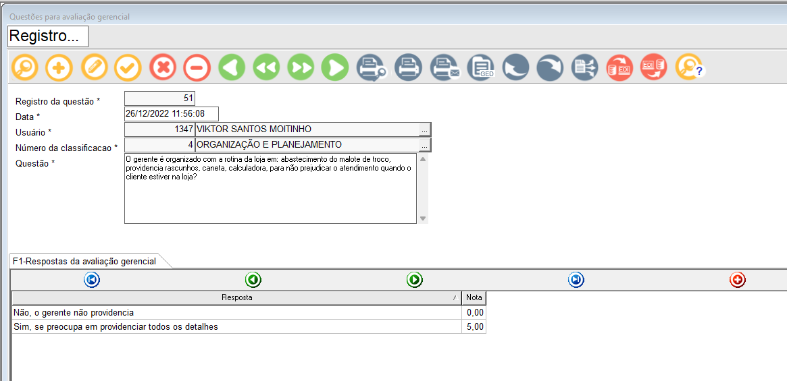
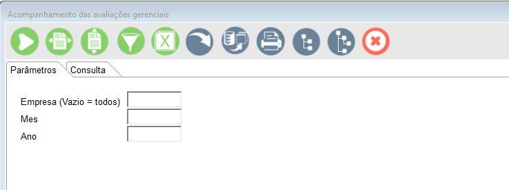
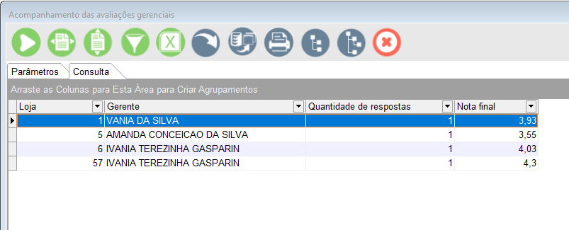
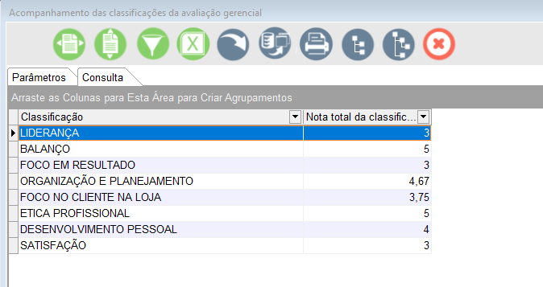
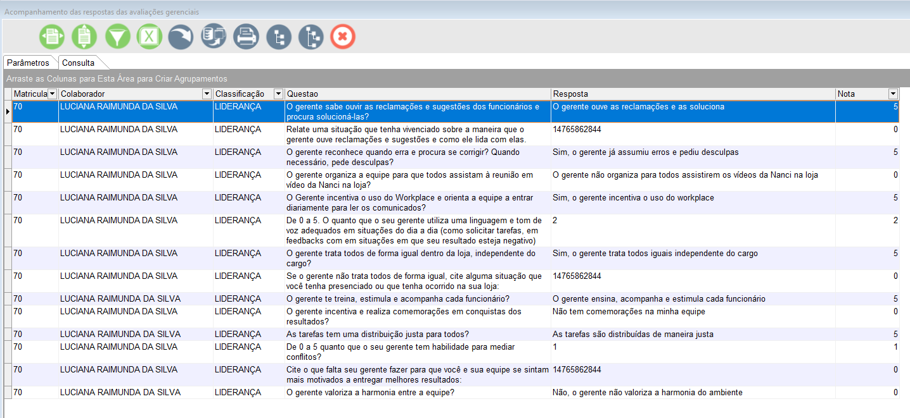

# Avaliação Gerencial 

## Pré-requisitos

Antes de começar, verifique se você atendeu aos seguintes requisitos:

* Você necessita ter instalado <br>
     `'PHP 8.1 ou Superior'`<br>
     `Apache2 2.4.52 ou superior`<br>
     `'Composer 2.2.6 ou superior'`<br>
     `Laravel 9.0 ou superior`<br>
 	* Compatível com <br>
	 `<Windows / Linux / Mac>`.


## Instalando o projeto 

Para instalação, siga estas etapas:

Linux :
```
1 - Faça a clonagem do repositório dentro da pasta /var/www/hmtl.
    1.1 - Sugestão: Dê permissão 755 de forma recursiva para a pasta /var e adicione o seu usuário ao grupo de donos da pasta. 
2 - Após a clonagem do projeto, abra o mesmo em seu editor de texto. 
3 - Utilize o comando composer update para a atualização do projeto.
4 - Crie o arquivo .Env com base no .Env.example
```

Windows:
```
1 - Faça a clonagem do repositório dentro da pasta htdocs.
2 - Após a clonagem do projeto, abra o mesmo em seu editor de texto. 
3 - Utilize o comando composer update para a atualização do projeto.
4 - Crie o arquivo .Env com base no .Env.example
```

## Dependências do projeto

Para a utilização do projeto é necessário alguns dependências, configurações e recursos do nosso banco de dados, elas são:

### Tabelas 

> #### 1 - AG_USUARIOS
> Guarda todos os dados **necessários** para o login dos usuários.
> - ID (BIGINT): Chave primária da tabela auto incrementada. 
> - Name (VARCHAR(255)): Nome do usuário.
> - Password (NVARCHAR(255)): Senha do usuário criptografa com MD5.
> - Registration (NVARCHAR(255)): Matrícula do usuário.
> - Store (INT): Loja onde o usuário trabalha.
> - Manager (NVARCHAR(255)): Confirmação se o usuário é ou não um gerente.

---

> #### 2 - AG_CLASSIFICACAO
> Guarda todas as classificações das perguntas da avaliação gerencial.
> - AG_CLASSIFICACAO (NUMERIC(15,2)): Chave primária da tabela auto incrementada. 
> - CLASSIFICACAO (VARCHAR(50)): Nome da classificação.

---

> #### 3 - AG_QUESTOES
> Guarda todas as perguntas necessários para a avaliação gerencial.
> - AG_QUESTAO (NUMERIC(15,2)): Chave primária da tabela auto incrementada. 
> - DATA_HORA (DATETIME): Data e hora da inserção da pergunta no banco de dados.
> - AG_CLASSIFICACAO (NUMERIC(15,0)) : Chave estrangeira da tabela <STRONG>AG_CLASSIFICACAO</STRONG>
> - QUESTAO (VARCHAR(MAX)) : Campo de texto com a pergunta cadastrada no banco.
    
---

> #### 4 - AG_RESPOSTAS
> Guarda todas as respostas necessários para a avaliação gerencial.
> - AG_RESPOSTA (NUMERIC(15,0)): Chave primária da tabela auto incrementada. 
> - AG_QUESTAO (NUMERIC(15,2)): Chave estrangeira da tabela <STRONG>AG_QUESTOES</STRONG>
> - RESPOSTA (VARCHAR(MAX)) : Campo de texto com a resposta cadastrada no banco, que pode ser fixa ou um campo dissertativo.
> - NOTA (NUMERIC(5,2)) : Nota fixa que é atribuida a cada resposta
    
 ---

> #### 5 - AG_FORM_RESPOSTAS
> Guarda todas as perguntas e respostas dados pelos usuários.
> - AG_FORM_RESPOSTA (NUMERIC(15,0)): Chave primária da tabela auto incrementada. 
> - AG_QUESTAO (NUMERIC(15,2)): Chave estrangeira da tabela <STRONG>AG_QUESTOES</STRONG>.
> - AG_RESPOSTA (VARCHAR(MAX)) : Chave estrangeira da tabela <STRONG>AG_RESPOSTAS</STRONG> ou texto inserido pelo usuário nas questões dissertativas.
> - AG_CLASSIFICACAO (NUMERIC(15,2)): Chave estrangeira da tabela <STRONG>AG_CLASSIFICACAO</STRONG>.
> - AG_USUARIO (NUMERIC(15,2)) : Usuário logado no sistema (ID da tabela AG_USUARIOS).
> - AG_MATRICULA (NUMERIC(15,2)) : Matricula do usuário logado no sistema (Registration da tabela AG_USUARIOS).
> - DATA_RESPOSTAS (VARCHAR(15)) : Mês e ano no horário da resposta.
> - AG_LOJA (NUMERIC(15,2)) : Loja do usuário logado no sistema (Store da tabela AG_USUARIOS).

 ---

> #### 6 - AG_STATUS
> Guarda a informação de quais usuários e quais formulários ele já respondeu.
> - AG_STATUS (NUMERIC(15,0)): Chave primária da tabela auto incrementada. 
> - AG_CLASSIFICACAO (NUMERIC(15,2)): Chave estrangeira da tabela <STRONG>AG_CLASSIFICACAO</STRONG>.
> - AG_USUARIO (NUMERIC(15,2)) : Usuário logado no sistema (ID da tabela AG_USUARIOS).
> - AG_MATRICULA (NUMERIC(15,2)) : Matricula do usuário logado no sistema (Registration da tabela AG_USUARIOS).
> - AG_DATA (VARCHAR(15)) : Mês e ano no horário da resposta.


> #### 7 - AG_FEEDBACK_SEMESTRAIS_SUPERVISAO
> Guarda a informação do feedback aplicado pelo supervisor ao gerente
> -	AG_FEEDBACK_SEMESTRAL_SUPERVISAO numeric(18,0) : Chave primária da tabela auto incrementada,
> -	LOJA numeric(18,0) : Número da loja,
> -	GERENTE numeric(18,0) : Matrícula do gerente, 
> -	DATA_FEEDBACK date : Data de aplicação do feedback
> -	OBJETIVO varchar(MAX) : Objetivo descrito pelo supervisor
> -	ANOTACOES varchar(MAX) : Anotações realizadas pelo supervisor
> -	SUPERVISOR numeric(18,0) : Matrícula do supervisor

 
> #### 8 - AG_FEEDBACK_SEMESTRAIS_SUPERVISAO_DETAIL
> Guarda mais informações do feddback, podente ter mais de uma linha em relação a tabela anterior
> - AG_FEEDBACK_SEMESTRAL_SUPERVISAO_DETAIL numeric(18,0) : Chave primária da tabela auto incrementada,
> - AG_FEEDBACK_SEMESTRAL_SUPERVISAO numeric(18,0) : Chave estrangeira da tabela <STRONG>AG_FEEDBACK_SEMESTRAIS_SUPERVISAO</STRONG>.
> -	HABILIDADES_DESENVOLVER varchar(MAX) : Campo descritivo realizado pelo supervisor,
> -	HABILIDADES_RECONHECER varchar(MAX)  : Campo descritivo realizado pelo supervisor ,
> -	DATA_INICIAL_PLANO_ACAO date NULL : Data inicial para realizar as ações,
> -	DATA_FINAL_PLANO_ACAO date NULL : Data limite para realizar as ações,
> -	ACAO_PLANO_ACAO varchar(MAX) : Campo descritivo realizado pelo supervisor	,
> -	ENTREGA_PLANO_ACAO varchar(MAX) : Campo descritivo realizado pelo supervisor,
> -	RECURSO_PLANO_ACAO varchar(MAX) : Campo descritivo realizado pelo supervisor ,
> -	STATUS_PLANO_ACAO varchar(MAX) : Campo descritivo realizado pelo supervisor 


> #### 9 - AG_LIBERACAO_QUESTOES_MENSAIS
> Guarda as informações de quais as perguntas que serão liberadas de forma bimestral para as lojas
> -	AG_LIBERACAO_QUESTAO_MENSAL numeric(18,0)  : Chave primária da tabela auto incrementada,
> -	SUPERVISOR numeric(18,0) : Matrícula do supervisor,
> -	LOJA numeric(18,0) 	: loja do gerente	 ,
> -	DATA_AUTORIZACAO date : data de liberação das questões	 ,
> -	DATA_LIMITE_RESPOSTA date : data limite para responder as questões,
> -	GERENTE varchar(200) : matricula do gerente da loja,
> -	ID_CLASSIFICACAO numeric(18,0) : codigo da classificação liberada


> ### 10 - AG_FEEDBACK_AUTO_PERCEPCAO_GERENTES
> Guarda as informações da visão do gerente sobre ele mesmo dentro do feedback
> -	AG_FEEDBACK_AUTO_PERCEPCAO_GERENTE numeric(18,0) : Chave primária da tabela auto incrementada,
> -	AG_FEEDBACK_SEMESTRAL_SUPERVISAO numeric(18,0) : código do feedback,
> -	AUTO_PERCEPCAO varchar(MAX) : texto descritivo do gerente sobre si mesmo,
> -	checkfeedback varchar(1) : confirmação do recebimento do feedback pelo genrete


#### Visualização de dados 
A view *AG_GERENTE_PERCEPCAO* traz os dados necessários para que o gerente visualize as respostas dados pelos funcionários

````
									
create view AG_GERENTE_PERCEPCAO
AS 
SELECT 
A.AG_LOJA,
A.AG_QUESTAO,
A.AG_CLASSIFICACAO,
C.CLASSIFICACAO  ,
A.AG_RESPOSTA,
A.RESPOSTA,
CASE 
	WHEN A.AG_RESPOSTA = A.RESPOSTA THEN 0
	ELSE ((CONVERT(DECIMAL(15,2),A.QTD_RESPOSTA) / CONVERT(DECIMAL(15,2),B.QTD_RESPOSTAS_POR_QUESTAO)) * 100)
END AS PORCENTAGEM,
CASE 
	WHEN A.AG_RESPOSTA = A.RESPOSTA THEN 'S'
	ELSE 'N'
END AS COMENTARIO ,
A.DATA_RESPOSTAS
FROM 
(	 
	SELECT
	AG_LOJA,
	 A.AG_QUESTAO,
	 A.AG_RESPOSTA,
	 A.AG_CLASSIFICACAO,
	 A.DATA_RESPOSTAS,
    CASE
        WHEN LTRIM(RTRIM( A.AG_RESPOSTA)) NOT LIKE '%[0-9]%' AND B.RESPOSTA IS NULL 
           
          THEN A.AG_RESPOSTA
          ELSE B.RESPOSTA
    END AS RESPOSTA,
	 
	 COUNT(A.AG_RESPOSTA) AS QTD_RESPOSTA
	 FROM AG_FORM_RESPOSTAS A
	 left  JOIN(
	 	 SELECT 
	 	 	CONVERT(VARCHAR(MAX),AG_RESPOSTA ) AS AG_RESPOSTA,
	 	 	RESPOSTA,
	 	 	NOTA FROM AG_RESPOSTAS
	 	 	WHERE RESPOSTA NOT IN ('0','1','2','3','4','5')
	 	 	
	  ) B ON A.AG_RESPOSTA = B.AG_RESPOSTA 
	 WHERE A.DATA_RESPOSTAS = (SELECT CONCAT(MONTH(GETDATE()), '/',YEAR(GETDATE()) ))
	  GROUP BY AG_LOJA,
	 A.AG_QUESTAO,
	 A.AG_RESPOSTA,
	 A.AG_CLASSIFICACAO,
	 A.DATA_RESPOSTAS,A.AG_RESPOSTA, B.RESPOSTA
) A
	  left JOIN ( 
			SELECT 
			AG_LOJA,	
			AG_QUESTAO , 
			COUNT(AG_RESPOSTA) AS QTD_RESPOSTAS_POR_QUESTAO 
			FROM AG_FORM_RESPOSTAS A
			WHERE A.DATA_RESPOSTAS = (SELECT CONCAT(MONTH(GETDATE()), '/',YEAR(GETDATE()) ))
	 		GROUP BY AG_QUESTAO , AG_LOJA
) B ON A.AG_QUESTAO = B.AG_QUESTAO AND  A.AG_LOJA = B.AG_LOJA
JOIN AG_CLASSIFICACAO  C ON A.AG_CLASSIFICACAO = C.AG_CLASSIFICACAO 
WHERE A.RESPOSTA IS NOT NULL 
AND A.DATA_RESPOSTAS = (SELECT CONCAT(MONTH(GETDATE()), '/',YEAR(GETDATE()) ))
````

### Aplicação WEB

O projeto é web, ou seja, é executado nos navegadores. Para o desenvolvimento foi utilizado PHP, JS, BootStrap, além de HTML e Css puros. Foi utilizado também o framework laravel.
Abaixo estarão prints de toda a aplicação.


#### Tela de Login 


### Procfit 

O projeto, além de ser uma aplicação web possuí conexão com o framework Procfit. Essa conexão se dá devido aS consultas e formulários criados para a educação corporativa. <br>
#### 1 - Formulário de questões será utilizado para que a educação corporativa possa incluir, editar ou excluir questões das avaliações gerenciais <br>
 <br>

#### 2 - A consulta das avaliações gerenciais será utilizada para que a educação corporativa possa visualizar as informações utilizando filtros diferentes, como classificação, loja, funcionários entre outros. <br>
 <br>
 <br>
 <br>
 <br>


